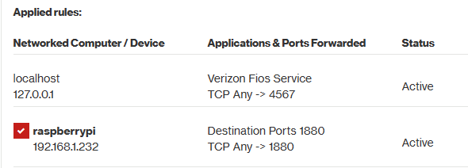

# pool-ctrl

Link to my post on troublefreepool.com:  
https://www.troublefreepool.com/threads/my-new-black-decker-vsp-and-diy-pool-controller.272642/  

## Installation instructions

The instructions below assume that:
- the Rspbian OS has already been installed
- you have an account with sudo capability as a human user
- node-red will run under its own account (in the source code it's 'poolboy')

1. Login to raspberry pi and create an account for node-red, for example 'pi', if it doesn't exist yet:
     ```console
     sudo adduser pi
     ```
     and add it to sudoers by inserting this line into /etc/sudoers file:
    ```console
    pi ALL=(ALL) NOPASSWD:ALL
    ```
     By default, node-red listens to HTTP requests on port 1880, so it doesn't require superuser privileges (the port is > 1024). After getting the whole system to work, for the sake of security you should remove the pi's ability to sudo without asking for password. To do that, you would modify the 'pi' entry in /etc/sudoers to:
    ```console
    pi ALL=(ALL) ALL
    ```
2. Log into 'pi' account:
    ```console
    su - pi
    ```
3. Install git: 
    ```console
    sudo apt install git
    ```
4. Install node-red. There is an official documentation detailing the process: (https://nodered.org/docs/getting-started/raspberrypi) and a multitude of tutorials. Node-red needs to run as a service, either directly under systemd control, or node.js' facility pm2.
5. Install Sequent Microsystems software for Building Automation HAT. Follow instructions in https://cdn.shopify.com/s/files/1/0534/4392/0067/files/BuildingAutomation-UsersGuide_4d9d6112-ca15-4715-8dd6-4a38731161db.pdf?v=1676868359.
6. Install Sequent Microsystems software for Eight Relays HAT. Follow instructions in 
https://cdn.shopify.com/s/files/1/0534/4392/0067/files/8-RELAYS-UsersGuide-V5.pdf?v=1677024406.
7. Clone the pool-ctrl repository:
    ```console
    git clone https://github.com/hexabc/pool-ctrl
    ```
8. Generate a hashed password to protect the dashboard and the editor web applications:
    ```console
    node-red admin hash-pw
    ```
    You will be prompted to type your password and the command will print a bcrypt hash on standard output:
   ```console
   $2b$08$2g0QsAuJZ68lCFTIFofGkOJNjF1bYgNrIVoxPPFdHm3P/qnVGWKB2
   ```
9. Generate the TLS certificate. Make sure to set the certificate's common name to the hostname of your raspberry pi ('raspberrypi' by default):
   ```console
   mkdir pool-ctrl-certs
   cd pool-ctrl-certs
   openssl genrsa -out privkey.pem 2048
   openssl req -new -sha256 -key privkey.pem -out cert.pem
   openssl x509 -req -in cert.pem -signkey privkey.pem -out signcert.pem
   ```
10. Edit settings.js file. You should be now in ~pi/pool-ctrl-certs directory:
    ```console
    cd ..
    vi pool-ctrl/settings.js
    ```
    10.1. Replace password values in adminAuth and httpNodeAuth objects with your bcrypt hash.

    10.2. Set userDir to your pool-ctrl project's root directory ('/home/pi/pool-ctrl').

    10.3. Make sure the locations of privkey.pem and signcert.pem files in https:function() object are correct.

Start the node-red service and type https://rpi-private-ip-address:1880/ui URL into your browser to access the dashboard. Type https://rpi-private-ip-address:1880/edit to access the editor. Substitute the real IP address of the raspberry pi for rpi-private-ip-address placeholder, for example:
```console
https://192.168.1.232:1880/ui
https://192.168.1.232:1880/edit
```

Now you have a secure, end-to-end encrypted web application working on your private network 192.168.0.0/16. Passwords that you enter cannot be eavesdropped. Don't get fooled by the browser warning that your certificate is self-signed and the connection is "Not secure". You don't need any authority to sign the certificate; you know that was you who created it, and only you possess the private encryption key. It'd be a different matter, of course, if the pool-ctrl website were destined for a wide audience that'd like to see a proof the website is legitimate.

## Accessing pool-ctrl website from the Internet

You can go one step further now and configure your firewall to forward incoming HTTP requests to port 1880 to the raspberrypi host's private IP address. This feature of the firewall is called Port Forwarding and its configuration might look something like this:



Now you would be able to use your router's public, routable IP address to reach the application from any place in the world (well, not really, your internet provider's network might be implementing policies that discard requests from certain prefixes):
```console
https://<public_ip_address>:1880/ui
https://<public_ip_address>:1880/edit
```
It's true that unless we pay for a static IP address, the assigned public address may change after the router reboot, but usually it stays the same for months, depending on the internet provider, and the change doesn't have much impact on us, IoT users. All we need to do is update hyperlinks in our smartphones and laptops.
