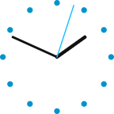
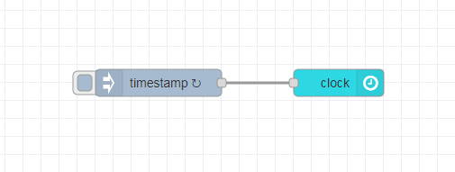

# node-red-contrib-ui-clock

A simple analog clock for the Node-RED Dashboard.



## Installation

Open Node-RED and select `Manage palette` from the menu to open the Palette Manager. Go to the `Install` tab, search for `node-red-contrib-ui-clock` and click `install`.

Alternatively, you can run the following command in your Node-RED user directory (typically `~/.node-red`):

```
npm i node-red-contrib-ui-clock
```

## Example



```
[{"id":"e10131f9.ffd3c","type":"tab","label":"Flow 1","disabled":false,"info":""},{"id":"152fc3e8.74c47c","type":"inject","z":"e10131f9.ffd3c","name":"","props":[{"p":"payload"},{"p":"topic","vt":"str"}],"repeat":"1","crontab":"","once":true,"onceDelay":0.1,"topic":"","payload":"","payloadType":"date","x":510,"y":180,"wires":[["80f10a2a.2e1c48"]]},{"id":"80f10a2a.2e1c48","type":"ui_clock","z":"e10131f9.ffd3c","name":"","group":"64eefd31.f05964","order":6,"width":"0","height":"0","x":710,"y":180,"wires":[]},{"id":"64eefd31.f05964","type":"ui_group","z":"","name":"Default","tab":"7fa2758c.04062c","order":1,"disp":true,"width":"9","collapse":false},{"id":"7fa2758c.04062c","type":"ui_tab","z":"","name":"Home","icon":"dashboard","disabled":false,"hidden":false}]
```

## License

[MIT](LICENSE)